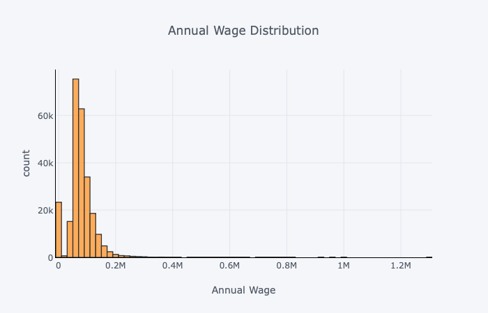
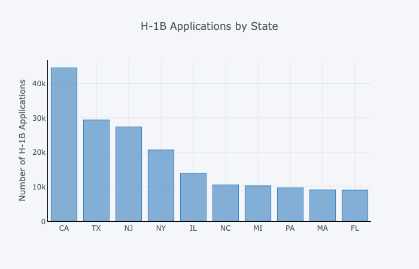
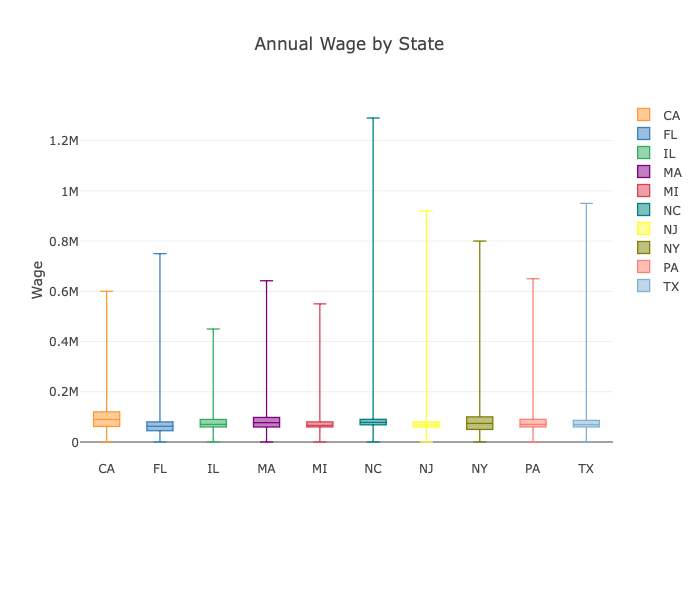
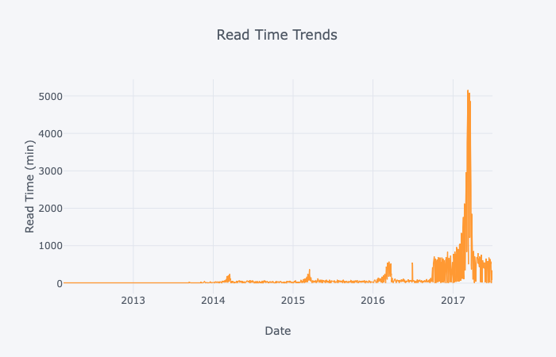
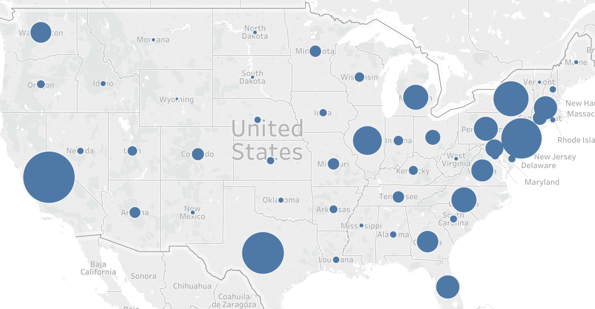
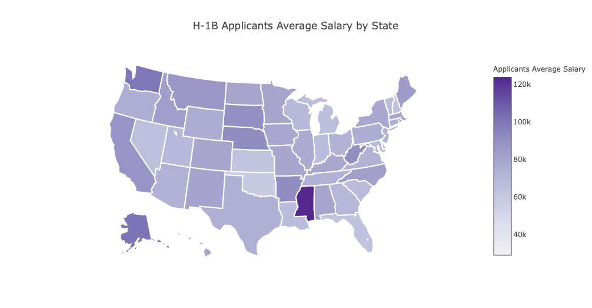
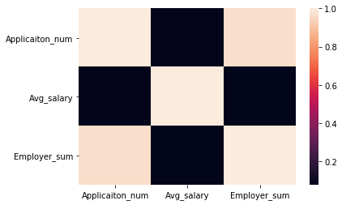
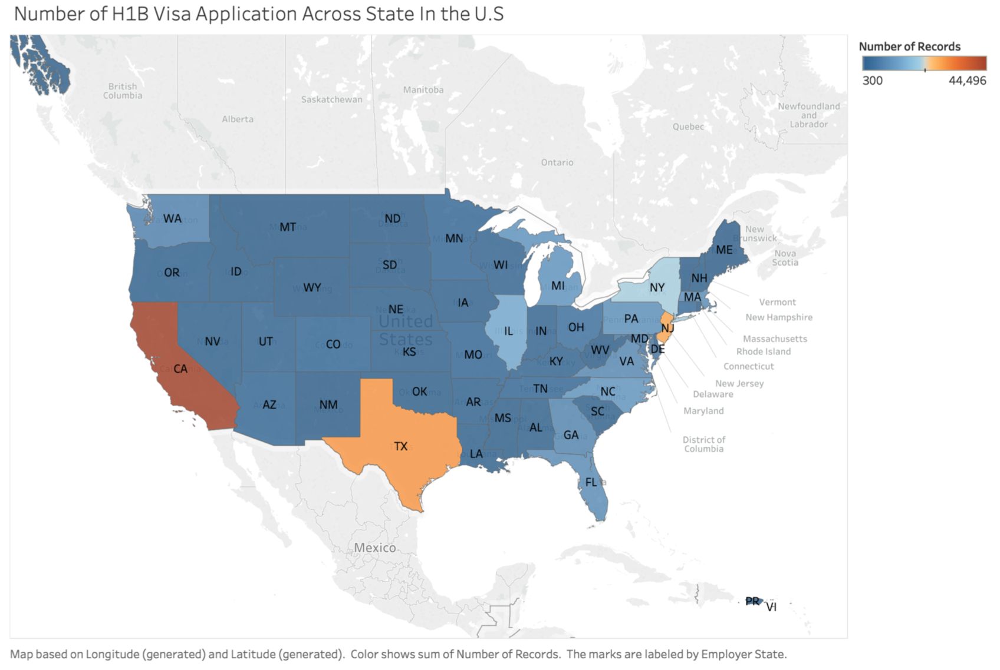
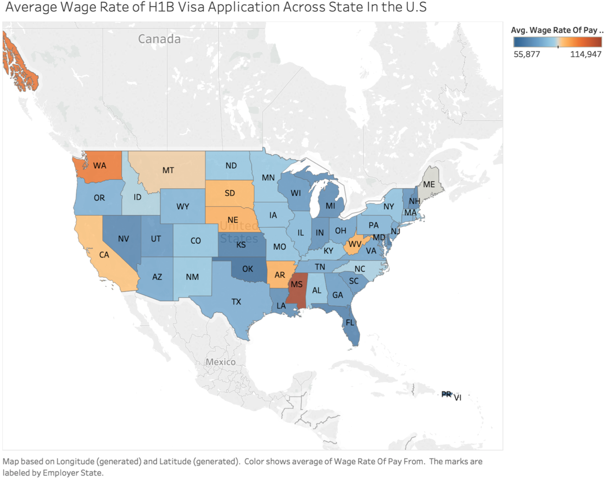
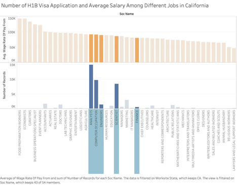

#Final Report
Tianqi Wang  
[Code link](https://github.com/tianqwang/Data_Visualization)

##  Introduction

**What is this dataset?**  
The dataset I chose is the H-1B Visa Application dataset. 
The H-1B Dataset selected for this project contains data from employer’s Labor Condition Application and the case certification determinations processed by the Office of Foreign Labor Certification (OFLC) where the data of the determination was issues on or after October 1, 2016 and on or before June 30, 2017.

**Where did you get it from?**

The dataset is from Office of Foreign Labor Certification (OFLC). OFLC is a division of the U.S. Department of Labor. 

**Why did you choose this particular data?**

The reason why I choose this data is I just started job searching, and I think the insights from this data could help me get a better idea about the jobs. Since I am an international student, the working Visa would be important to me, and also some information about the salary could also be important for me to make a better decision about jobs.

**What types of questions were you hoping to explore with this data?**
Some questions related to working visa application approve rate and numbers, and also some salary statistics I am hoping to explore.

## Summary of Data

### Histogram
Firstly check the distribution of annual wage.

### Barplot
Check the H-1B application numbers by state.

### Boxplot
Use boxplot to check the annual wage range for the top 10 states which has the most H-1B applications.

### Scatterplot
Use scatterplot to track the time series trend for the whole H-1B application numbers.

### Bubble Map
Use the bubble map to check the H-1B application numbers by state.

### Cloropleth Map
Use the cloropleth map to check the applicants average salary by stata.

### Heat Map
The orginal data has few numeric features to make heatmap, so I firstly aggregate the data into state level, and make heatmap based on that to check  the  correlation.

## Storyline

The first thing I care is how many H-1B applications got approved in different states, more applications approved means more possible I could get the working Visa in the future. From the graph above, we can tell the distribution is highly imbalanced. Three states, California, New Jersey and Texas attribute to most of the H-1B visas, so if I really need working Visa, I should pay more attention to jobs in those three states.

Another thing I care is the salary (of cause), so I draw the average salary in different states. From this graph, we can notice the Mississippi, Washington have the highest average salary, but since the sample is too small, that could be misleading. If we only look at three states who have over 20,000 approved applications. Only California has an average pay that over $ 80,000 per year, much higher than Texas and New Jersey.
So based on the insights from these two graphs, the optimal choice for me is just to stay in California.

After checking the geographic distributions of H-1B approved application counts and average salary wage. From those analysis, I got the insight that to pursue a high probability to get a H-1B Visa and higher salary, the location is California. So I keep wondering what kind of position I would look for, if I stayed in California. To check this, I plot the H-1B approved application counts and average salary wage of all job titles.
Based on my background of data science and finance, I focus on 5 job titles: Analyst, Computer Occupation, Engineers, Scientist and Finance. Among those job titles, analyst, computer occupation and engineer are really close on average salaries, which are higher than scientist and finance related jobs. In terms of approved applications, analyst, computer occupation and scientist are significant higher than engineer and finance related jobs.
So the conclusion is, to get a higher paid job and to be more possible to get a H-1B visa, I should pay more attention to those analyst and computer related jobs.

